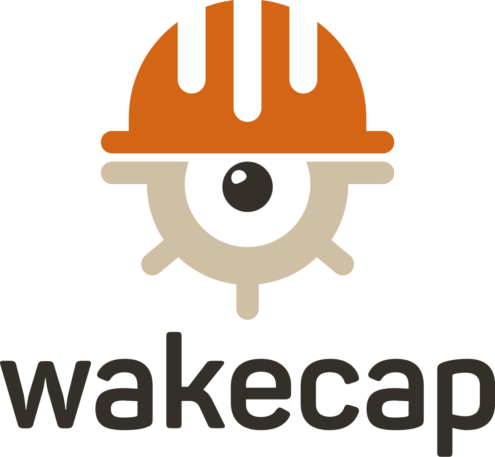

  

## APIs Documentation

This document explores how integration with [WakeCap](https://www.wakecap.com/) could be done.
WakeCap APIs allows a third party to have a full access over data.
In order to integrate with WakeCap APIs, you'll need to [contact us](https://www.wakecap.com/scheduledemo) to get your API secret token.

### Open Endpoints

WakeCap doesn't offer any open endpoints.

### Endpoints that require Authentication

Closed endpoints require a valid Token to be included in the header of the request. 

A Token can be acquired from [contact us](https://www.wakecap.com/scheduledemo).

### RestFul APIs

WakeCap RestFul APIs are based mainly on CRUD operations.

For example, Users Management System Can be called as following: 

* User Login `POST /api/users/login`
* User Registeration `POST /api/users/register`
* Logout `POST /api/users/logout`
